# analisis release 1 y diagramas plantuml

Documento base: `Proyecto Inge Software-1.pdf`

Adaptacion actual: EventMaster se transforma en SkillSharing. Por eso, `Evento` se interpreta como `Sesion de Aprendizaje`, las categorias pasan a `Habilidad`, los recursos pasan a `Material educativo`, y el enfoque ODS se mueve hacia ODS 4 educacion de calidad.

## historias del release 1

Segun la tabla del Sprint Planning 1 del PDF, el Release 1 incluye:

| id | historia original | adaptacion skillsharing |
| --- | --- | --- |
| UH01 | Crear evento | Crear sesion de aprendizaje |
| UH02 | Visualizar eventos gestionados | Visualizar sesiones que gestiono |
| UH04 | Detalle de evento | Detalle de sesion |
| UH06 | Invitar asistentes | Invitar aprendices a sesion privada |
| UH07 | Confirmar asistencia privada | Aceptar o rechazar invitacion privada |
| UH10 | Visualizar eventos a los que asisto | Visualizar sesiones a las que asisto |
| UH14 | Registrarse | Crear cuenta |
| UH15 | Iniciar sesion | Login con JWT |
| UH16 | Visualizar eventos publicos | Ver sesiones publicas activas |
| UH17 | Confirmar asistencia publica | Inscribirse a sesion publica |
| UH23 | Visualizar mi perfil | Ver perfil propio |
| UH24 | Cerrar sesion | Eliminar token local |
| UH26 | Visualizar invitados | Ver participantes confirmados |
| UH28 | Visualizar invitaciones privadas | Bandeja de invitaciones |
| UH29 | Activar cuenta | Endpoint de verificacion de cuenta |

## analisis del frontend

| id | pantalla frontend | estado | observacion |
| --- | --- | --- | --- |
| UH01 | `CrearSesionScreen` | cubierto | Ya envia `tipo` PUBLICA/PRIVADA y crea la sesion como pendiente |
| UH02 | `MisSesionesScreen` | cubierto | Tab `Que gestiono` consume `/sesiones/mis-sesiones` |
| UH04 | `DetalleSesionScreen` | cubierto | Muestra datos principales de la sesion |
| UH06 | `InvitarAsistentesScreen` | cubierto | Busca usuarios y envia invitacion a sesiones privadas |
| UH07 | `InvitacionesScreen` | cubierto | Permite aceptar o rechazar invitaciones |
| UH10 | `MisSesionesScreen` | cubierto | Tab `Que asisto` consume `/sesiones/mis-inscripciones` |
| UH14 | `RegisterScreen` | cubierto | Registra usuario inactivo y muestra mensaje para revisar correo |
| UH15 | `LoginScreen` | cubierto | Guarda JWT en AsyncStorage |
| UH16 | `HomeScreen` | cubierto | Lista sesiones publicas activas |
| UH17 | `DetalleSesionScreen` | cubierto | Boton confirmar asistencia para sesiones publicas activas |
| UH23 | `PerfilScreen` | cubierto | Muestra perfil y habilidades |
| UH24 | `HomeScreen` | cubierto | Boton salir elimina token local |
| UH26 | `DetalleSesionScreen` | cubierto | Muestra invitados confirmados desde `/sesiones/{id}/invitados` |
| UH28 | `InvitacionesScreen` | cubierto | Lista invitaciones privadas pendientes |
| UH29 | correo externo + navegador | cubierto | El backend envia enlace por SMTP2GO y activa la cuenta con `/api/auth/verificar` |

## faltantes o riesgos para hablar con el grupo

1. `UH29` depende de SMTP2GO y de las variables de entorno `SMTP_HOST`, `SMTP_PORT`, `SMTP_USERNAME`, `SMTP_PASSWORD`, `APP_EMAIL_FROM` y `APP_BASE_URL` en Render.
2. El PDF original no exige `HU05` en Release 1, pero la adaptacion SkillSharing pide material educativo obligatorio para aprobar sesiones. Backend existe; falta pantalla movil para subir PDF.
3. Las sesiones creadas quedan `PENDIENTE`; para que aparezcan en Home deben aprobarse con endpoint admin. No hay pantalla movil admin.
4. `HU28` tiene doble interpretacion: en el PDF es invitaciones privadas, pero en la adaptacion del proyecto tambien se uso como buscador por habilidad. El codigo soporta ambas, pero el informe debe aclarar esta decision.
5. Aun quedan textos con tildes/emoji en algunas pantallas antiguas. Para capturas finales conviene dejar todo en ASCII o corregir codificacion completa.

## der plantuml

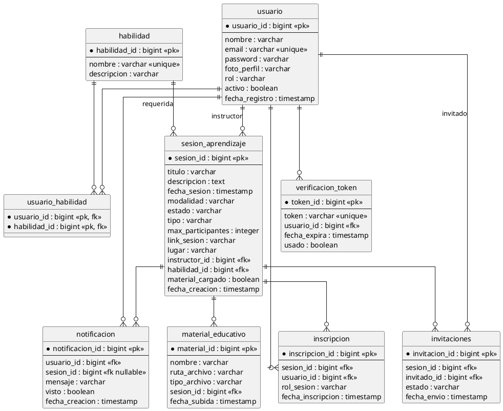

## diagrama de clases plantuml

```plantuml
@startuml
skinparam classAttributeIconSize 0
skinparam packageStyle rectangle

package "domain.entity" {
  class Usuario {
    - usuarioId : Long
    - nombre : String
    - email : String
    - password : String
    - fotoPerfil : String
    - rol : RolUsuario
    - activo : Boolean
    - fechaRegistro : LocalDateTime
    - habilidades : Set<Habilidad>
  }

  class Habilidad {
    - habilidadId : Long
    - nombre : String
    - descripcion : String
  }

  class SesionAprendizaje {
    - sesionId : Long
    - titulo : String
    - descripcion : String
    - fechaSesion : LocalDateTime
    - modalidad : ModalidadSesion
    - estado : EstadoSesion
    - tipo : TipoSesion
    - maxParticipantes : Integer
    - linkSesion : String
    - lugar : String
    - materialCargado : Boolean
    - fechaCreacion : LocalDateTime
  }

  class Inscripcion {
    - inscripcionId : Long
    - rolSesion : String
    - fechaInscripcion : LocalDateTime
  }

  class Invitacion {
    - invitacionId : Long
    - estado : EstadoInvitacion
    - fechaEnvio : LocalDateTime
  }

  class MaterialEducativo {
    - materialId : Long
    - nombre : String
    - rutaArchivo : String
    - tipoArchivo : String
    - fechaSubida : LocalDateTime
  }

  class Notificacion {
    - notificacionId : Long
    - mensaje : String
    - visto : Boolean
    - fechaCreacion : LocalDateTime
  }

  class VerificacionToken {
    - tokenId : Long
    - token : String
    - fechaExpira : LocalDateTime
    - usado : Boolean
  }
}

package "application.service" {
  class SesionService {
    + crearSesion(instructorId : Long, dto : SesionRequestDto) : SesionAprendizaje
    + listarActivas() : List<SesionAprendizaje>
    + obtenerDetalle(sesionId : Long) : SesionAprendizaje
    + listarPorInstructor(instructorId : Long) : List<SesionAprendizaje>
  }

  class InscripcionService {
    + inscribir(sesionId : Long, usuarioId : Long) : Inscripcion
    + listarPorUsuario(usuarioId : Long) : List<Inscripcion>
    + listarInvitados(sesionId : Long) : List<Inscripcion>
  }

  class InvitacionService {
    + enviarInvitacion(organizadorId : Long, sesionId : Long, invitadoId : Long) : Invitacion
    + listarMisInvitaciones(usuarioId : Long) : List<Invitacion>
    + responderInvitacion(invitadoId : Long, invitacionId : Long, aceptar : boolean) : void
  }

  class UsuarioService
  class MaterialService
  class BuscadorService
  class NotificacionService
}

package "patterns" {
  class SesionFactory <<factory>>
  class SesionFacade <<facade>>
  class SesionStateHandler <<state>>
  interface SesionObserver <<observer>>
  class NotificacionObserver <<observer>>
  interface BusquedaStrategy <<strategy>>
  class BusquedaPorHabilidad <<strategy>>
  class BusquedaPorTitulo <<strategy>>
  interface MaterialStoragePort <<adapter>>
  class MaterialStorageAdapter <<adapter>>
}

Usuario "1" -- "0..*" SesionAprendizaje : instructor
Usuario "0..*" -- "0..*" Habilidad
Habilidad "1" -- "0..*" SesionAprendizaje : requerida
SesionAprendizaje "1" -- "0..*" MaterialEducativo
SesionAprendizaje "1" -- "0..*" Inscripcion
Usuario "1" -- "0..*" Inscripcion
SesionAprendizaje "1" -- "0..*" Invitacion
Usuario "1" -- "0..*" Invitacion : invitado
Usuario "1" -- "0..*" Notificacion
SesionAprendizaje "0..1" -- "0..*" Notificacion
Usuario "1" -- "0..*" VerificacionToken

SesionService --> SesionFactory
SesionFacade --> SesionStateHandler
SesionFacade --> SesionObserver
NotificacionObserver ..|> SesionObserver
BusquedaPorHabilidad ..|> BusquedaStrategy
BusquedaPorTitulo ..|> BusquedaStrategy
BuscadorService --> BusquedaStrategy
MaterialService --> MaterialStoragePort
MaterialStorageAdapter ..|> MaterialStoragePort
@enduml
```

## diagrama de componentes plantuml

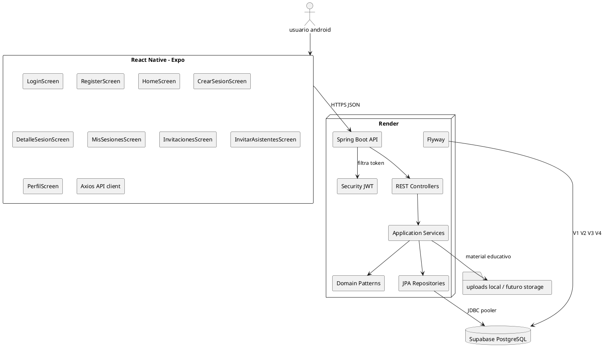

## arquitectura de software plantuml

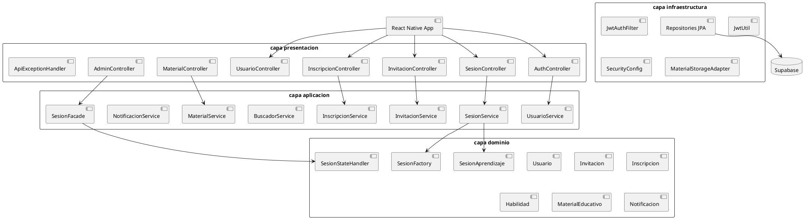

## secuencia UH01 crear sesion

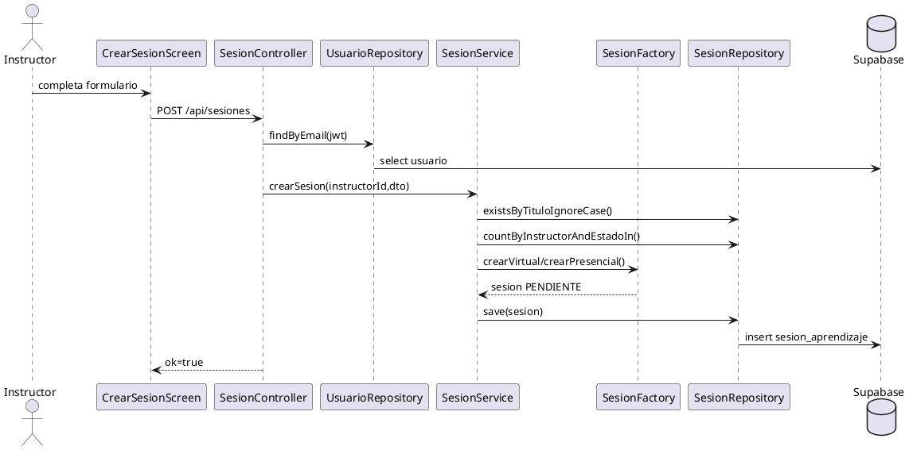

## secuencia UH02 visualizar sesiones gestionadas

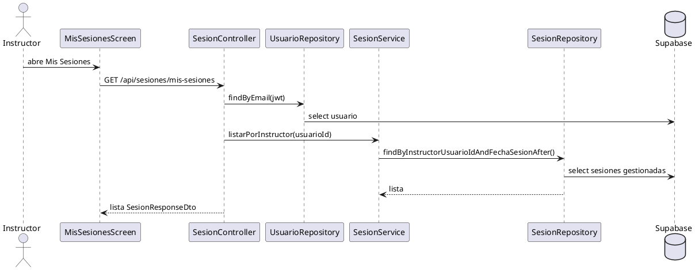

## secuencia UH04 detalle de sesion

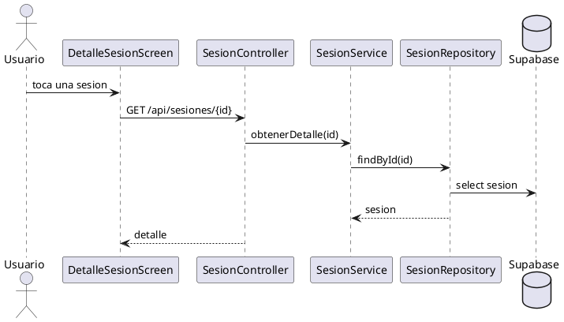

## secuencia UH06 invitar asistentes

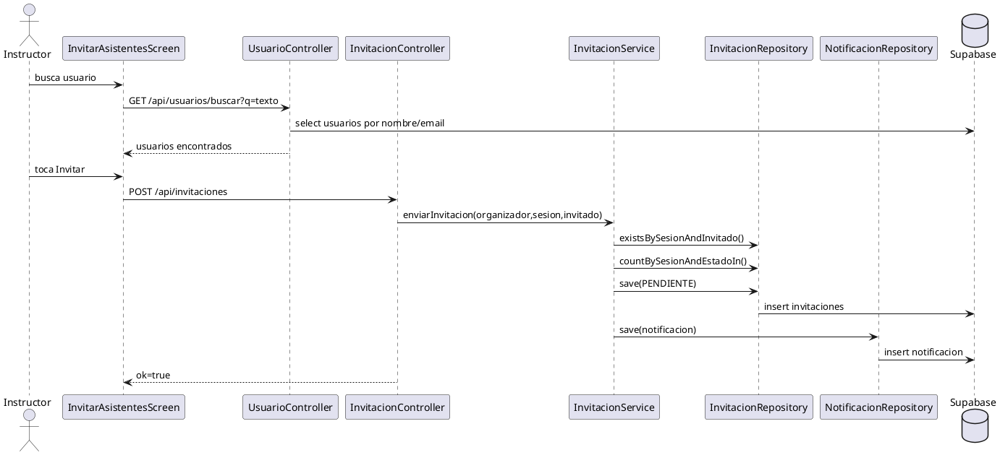

## secuencia UH07 confirmar asistencia privada

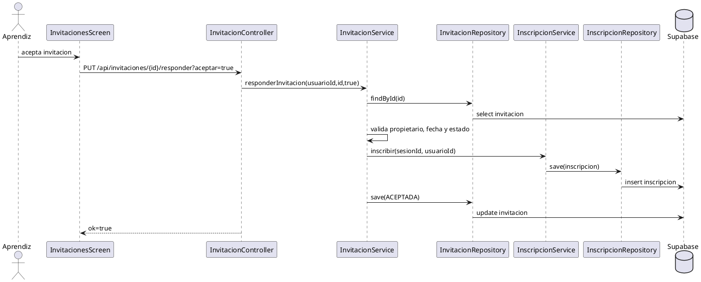

## secuencia UH10 visualizar sesiones a las que asisto

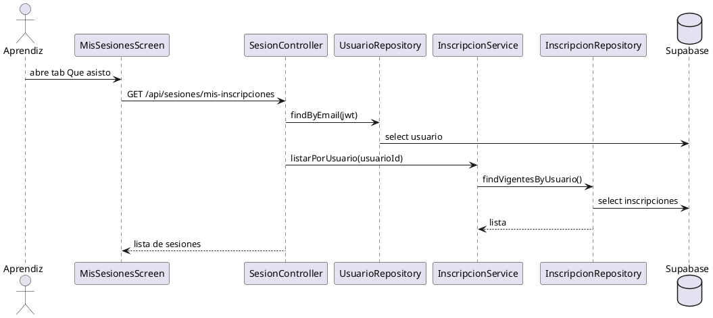

## secuencia UH14 registrarse

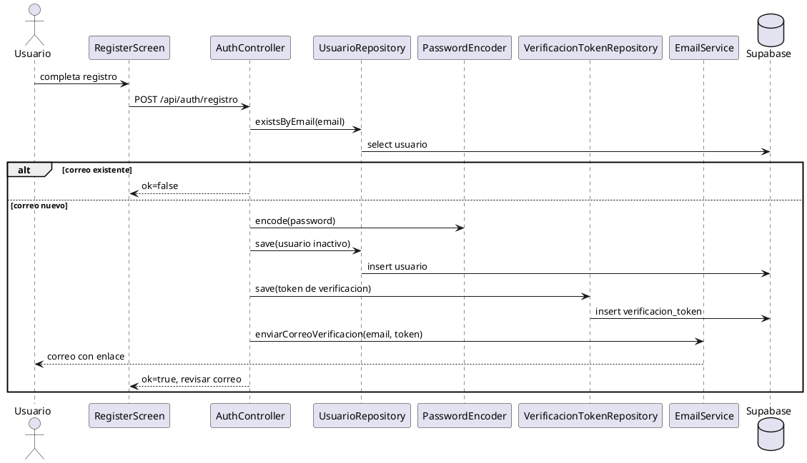

## secuencia UH15 iniciar sesion

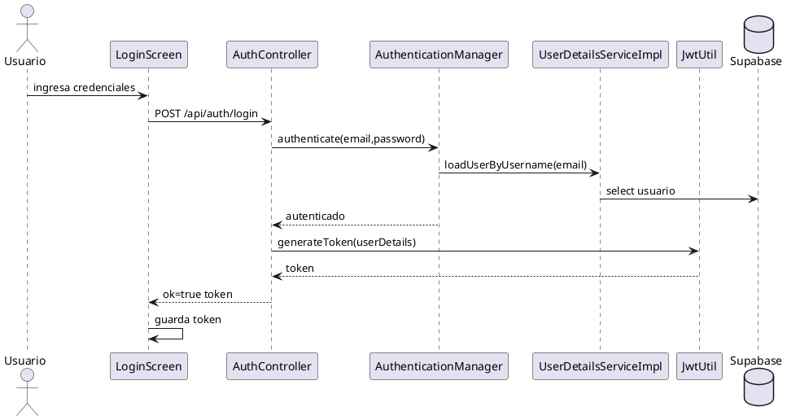

## secuencia UH16 visualizar sesiones publicas

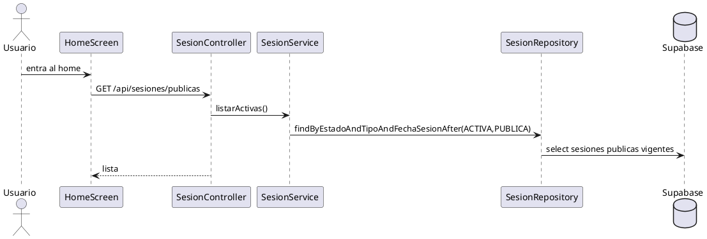

## secuencia UH17 confirmar asistencia publica

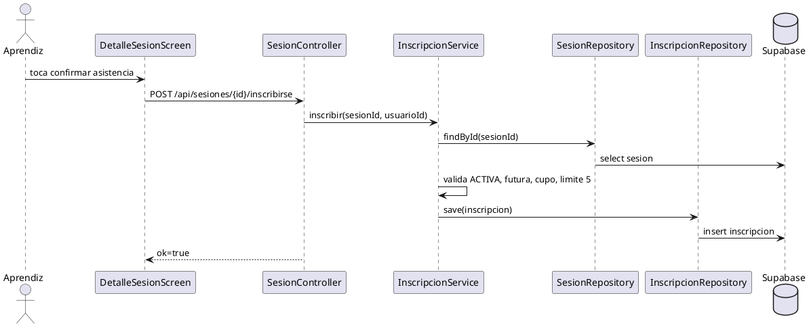

## secuencia UH23 visualizar mi perfil

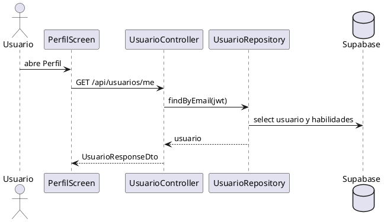

## secuencia UH24 cerrar sesion

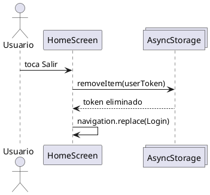

## secuencia UH26 visualizar invitados

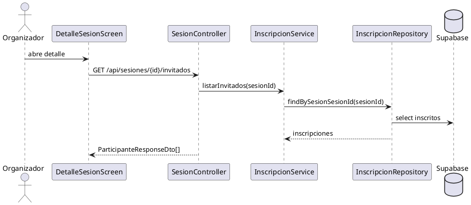

## secuencia UH28 visualizar invitaciones privadas

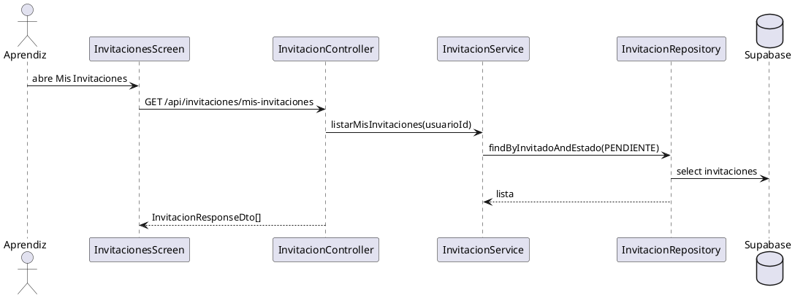

## secuencia UH29 activar cuenta

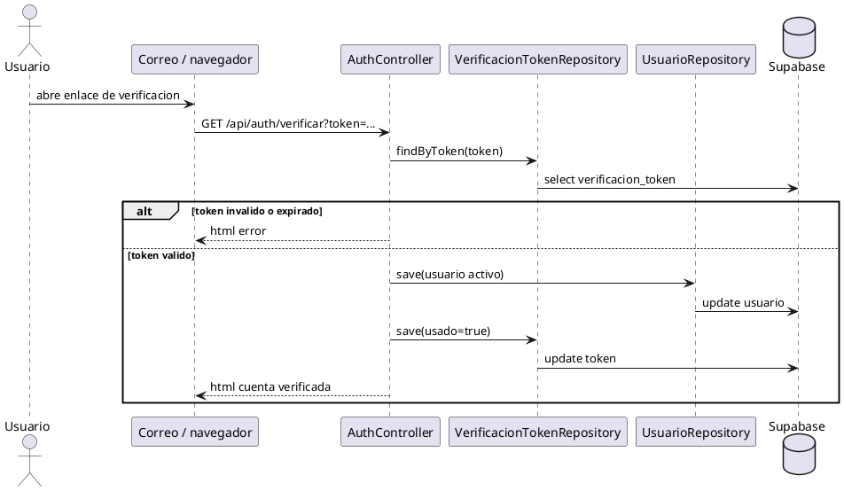
