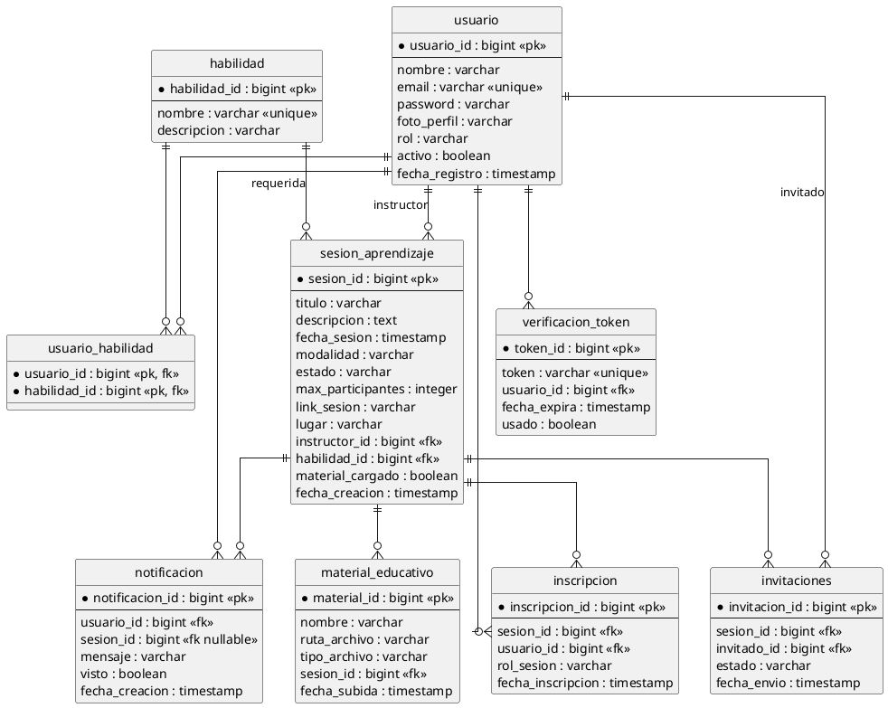
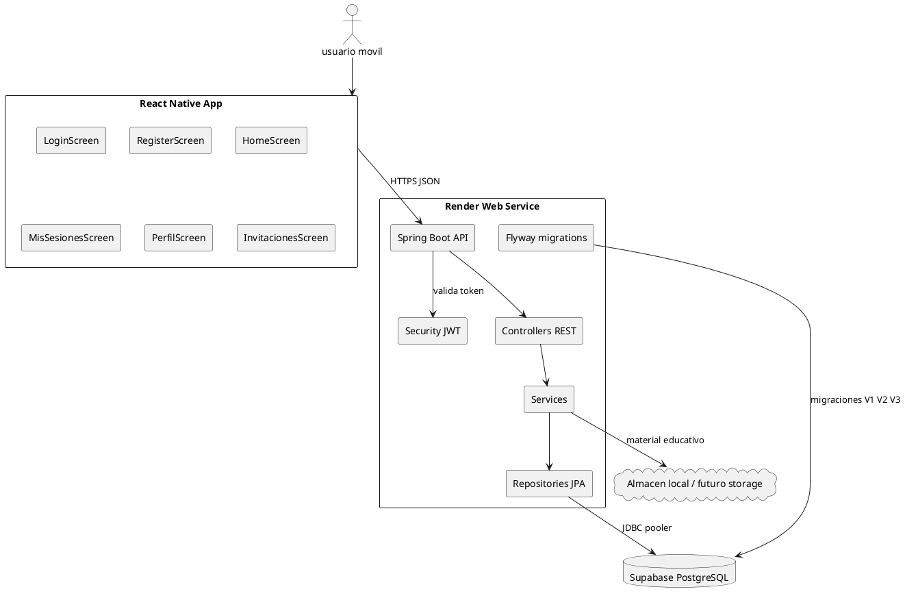
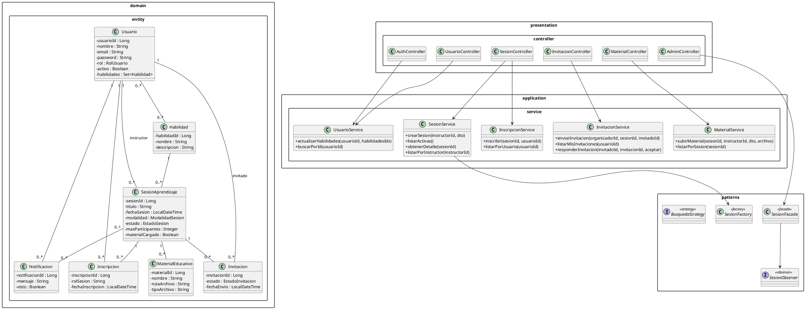
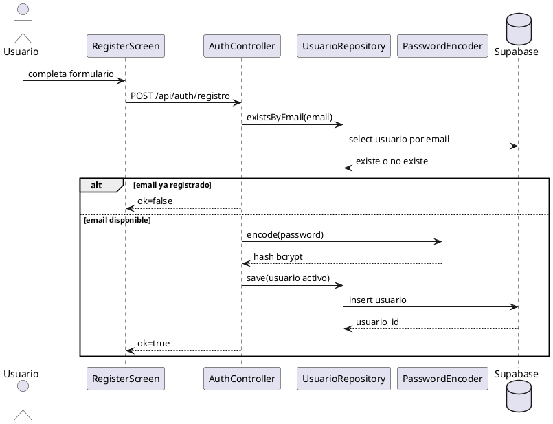
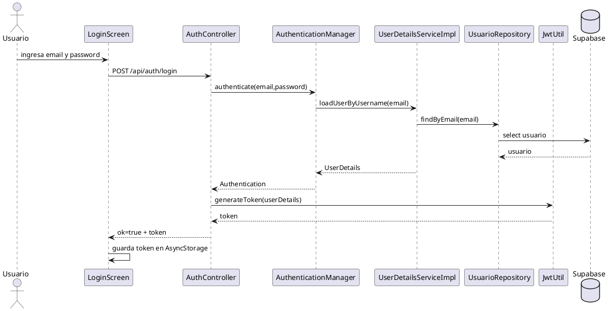
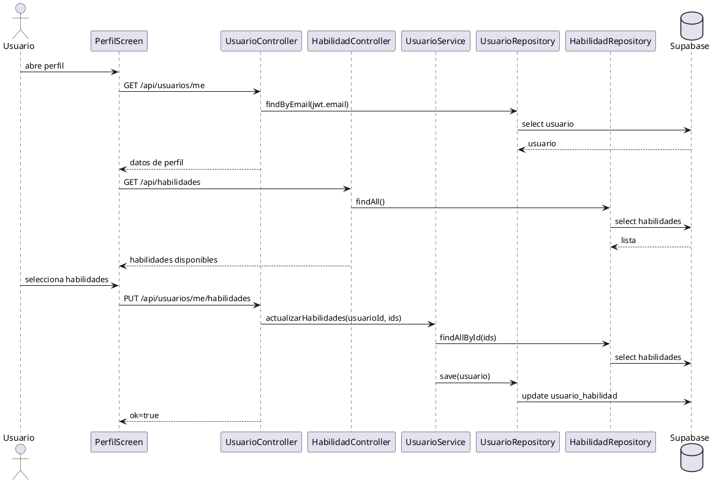
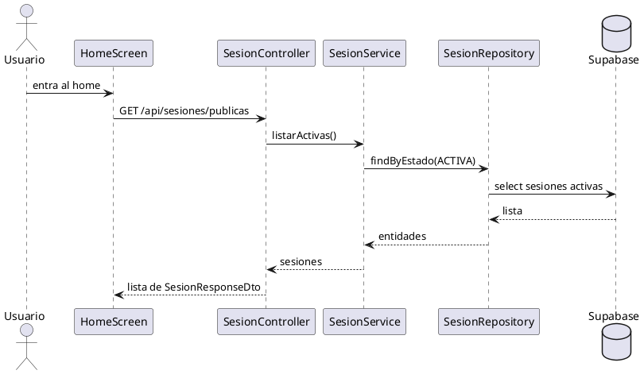
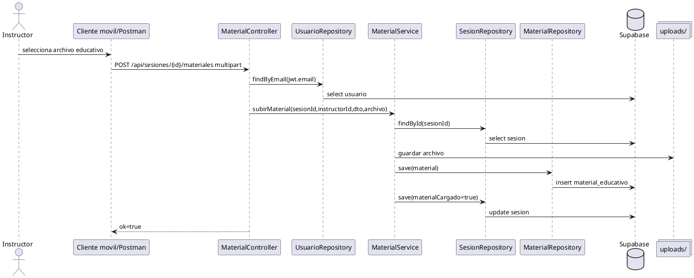
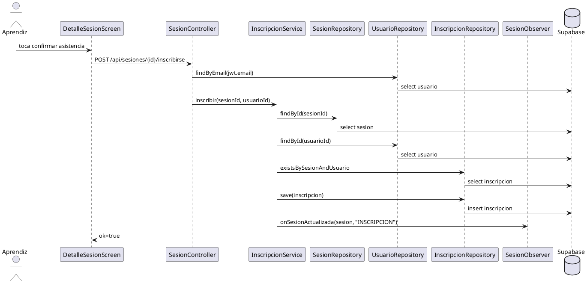
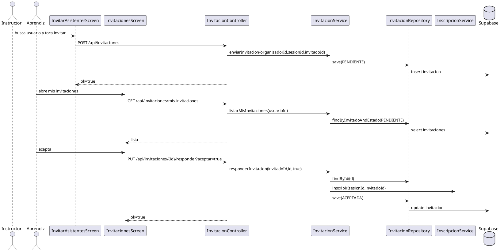

# analisis release 1 y diagramas plantuml

## alcance leido del documento release 1

El documento `TrabajoSoft_Documentacion release 1 (1).docx` define estas historias principales del release:

| id | historia del documento | cobertura actual |
| --- | --- | --- |
| US01 | registro de usuario | cubierto por `POST /api/auth/registro` |
| US02 | inicio de sesion | cubierto por `POST /api/auth/login` con JWT |
| US03 | registro de perfil con habilidad principal | cubierto parcialmente por perfil y multiples habilidades |
| US04 | visualizar catalogo de mentores/sesiones | cubierto como catalogo de sesiones activas, no catalogo directo de mentores |
| US05 | disponibilidad horaria o material educativo, segun seccion del documento | backend cubre material educativo, no horarios disponibles |
| US06 | solicitar sesion de aprendizaje a mentor | cubierto como inscripcion a sesion o invitacion privada, no como solicitud pendiente a mentor |

## incongruencias para conversar con el grupo

1. El documento dice "catalogo de mentores", pero la app muestra "sesiones disponibles".
2. El documento menciona horarios disponibles del mentor, pero la base de datos no tiene entidad de horarios.
3. El documento tambien menciona material educativo como parte del sprint, y el backend si lo tiene, pero el frontend movil no tiene pantalla para subir material.
4. La solicitud del documento queda en estado "pendiente"; el codigo actual maneja inscripcion directa o invitacion privada.
5. La app movil tiene un switch de sesion privada, pero el backend no guarda un campo de privacidad de sesion. Hoy se conserva como sesion publica para no romper el flujo.
6. La app pide duracion, pero la base de datos no tiene columna de duracion. El backend responde una duracion fija de 60 minutos solo para que la pantalla no quede vacia.
7. Las sesiones nuevas quedan en estado `PENDIENTE`. No salen en Home hasta que un admin las apruebe, y no hay pantalla movil de admin.
8. La verificacion por correo existe en codigo y base de datos, pero esta desactivada en registro por bloqueo SMTP de Render gratuito.
9. Hay funcionalidades extra frente al release: notificaciones, admin, busqueda por habilidad, invitaciones privadas y JWT.

## congruencia frontend backend corregida

| pantalla | llamada frontend | estado |
| --- | --- | --- |
| home | `GET /api/sesiones/publicas` | corregido con alias backend |
| mis sesiones | `GET /api/sesiones/mis-sesiones` | corregido con alias backend |
| mis asistencias | `GET /api/sesiones/mis-inscripciones` | corregido con alias backend |
| detalle | `POST /api/sesiones/{id}/inscribirse` | corregido con alias backend |
| invitaciones | `PUT /api/invitaciones/{id}/responder` | corregido con alias backend |
| invitar asistentes | `POST /api/invitaciones` con body | corregido con alias backend |
| perfil habilidades | `PUT /api/usuarios/me/habilidades` | backend acepta objeto `{ habilidadIds: [] }` |
| respuestas api | frontend revisa `ok` | corregido donde usaba `exito` |

## der plantuml

## diagrama de componentes

## diagrama de clases

## secuencia US01 registro de usuario

## secuencia US02 inicio de sesion

## secuencia US03 perfil y habilidades

## secuencia US04 catalogo de sesiones

## secuencia US05 material educativo

## secuencia US06 solicitar participacion en sesion

## secuencia extra invitacion privada

