# diagramas release 1 sprint 1

Alcance usado: UH01, UH02, UH04, UH06, UH07, UH10, UH14, UH15, UH16, UH17, UH23, UH24, UH26, UH28 y UH29.

Los diagramas reflejan el backend Java actual despues de limpiar funcionalidades de release 2.

## der

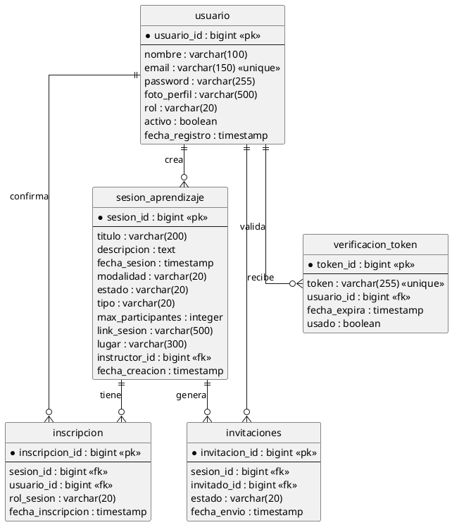

## diagrama de clases

```plantuml
@startuml
skinparam classAttributeIconSize 0
skinparam packageStyle rectangle
skinparam linetype ortho

package "domain.entity" {
  class Usuario {
    - usuarioId : Long
    - nombre : String
    - email : String
    - password : String
    - fotoPerfil : String
    - rol : RolUsuario
    - activo : Boolean
    - fechaRegistro : LocalDateTime
  }

  class SesionAprendizaje {
    - sesionId : Long
    - titulo : String
    - descripcion : String
    - fechaSesion : LocalDateTime
    - modalidad : ModalidadSesion
    - estado : EstadoSesion
    - tipo : TipoSesion
    - maxParticipantes : Integer
    - linkSesion : String
    - lugar : String
    - instructor : Usuario
    - fechaCreacion : LocalDateTime
  }

  class Inscripcion {
    - inscripcionId : Long
    - sesion : SesionAprendizaje
    - usuario : Usuario
    - rolSesion : String
    - fechaInscripcion : LocalDateTime
  }

  class Invitacion {
    - invitacionId : Long
    - sesion : SesionAprendizaje
    - invitado : Usuario
    - estado : EstadoInvitacion
    - fechaEnvio : LocalDateTime
  }

  class VerificacionToken {
    - tokenId : Long
    - token : String
    - usuario : Usuario
    - fechaExpira : LocalDateTime
    - usado : Boolean
  }

  enum RolUsuario {
    APRENDIZ
    INSTRUCTOR
  }

  enum ModalidadSesion {
    VIRTUAL
    PRESENCIAL
  }

  enum EstadoSesion {
    PENDIENTE
    ACTIVA
    FINALIZADA
    RECHAZADA
  }

  enum TipoSesion {
    PUBLICA
    PRIVADA
  }

  enum EstadoInvitacion {
    PENDIENTE
    ACEPTADA
    RECHAZADA
  }
}

package "domain.factory" {
  class SesionFactory {
    + crearVirtual(titulo, descripcion, fecha, maxParticipantes, linkSesion, instructor, tipo) : SesionAprendizaje
    + crearPresencial(titulo, descripcion, fecha, maxParticipantes, lugar, instructor, tipo) : SesionAprendizaje
  }
}

package "application.service" {
  class SesionService {
    + crearSesion(instructorId, dto) : SesionAprendizaje
    + listarActivas() : List<SesionAprendizaje>
    + obtenerDetalle(sesionId) : SesionAprendizaje
    + listarPorInstructor(instructorId) : List<SesionAprendizaje>
  }

  class InscripcionService {
    + inscribir(sesionId, usuarioId) : Inscripcion
    + listarPorUsuario(usuarioId) : List<Inscripcion>
    + listarInvitados(sesionId) : List<Inscripcion>
  }

  class InvitacionService {
    + enviarInvitacion(organizadorId, sesionId, invitadoId) : Invitacion
    + listarMisInvitaciones(usuarioId) : List<Invitacion>
    + responderInvitacion(invitadoId, invitacionId, aceptar) : void
  }

  class EmailService {
    + enviarCorreoVerificacion(destinatario, nombre, token) : void
  }
}

package "presentation.controller" {
  class AuthController {
    + registro(dto) : ResponseEntity<ApiResponse>
    + login(dto) : ResponseEntity<ApiResponse>
    + verificarCuenta(token) : ResponseEntity<String>
  }

  class SesionController {
    + crearSesion(dto, auth) : ResponseEntity<ApiResponse>
    + listarPublicas() : ResponseEntity<ApiResponse>
    + misSesiones(auth) : ResponseEntity<ApiResponse>
    + misInscripciones(auth) : ResponseEntity<ApiResponse>
    + inscribirse(sesionId, auth) : ResponseEntity<ApiResponse>
    + invitados(sesionId) : ResponseEntity<ApiResponse>
    + verDetalle(id) : ResponseEntity<ApiResponse>
  }

  class InvitacionController {
    + invitar(sesionId, invitadoId, auth) : ResponseEntity<ApiResponse>
    + invitarConBody(body, auth) : ResponseEntity<ApiResponse>
    + misInvitaciones(auth) : ResponseEntity<ApiResponse>
    + responder(invitacionId, aceptar, auth) : ResponseEntity<ApiResponse>
  }

  class InscripcionController {
    + asistirPublico(sesionId, auth) : ResponseEntity<ApiResponse>
    + misAsistencias(auth) : ResponseEntity<ApiResponse>
    + verInvitados(sesionId, auth) : ResponseEntity<ApiResponse>
  }

  class UsuarioController {
    + obtenerMiPerfil(auth) : ResponseEntity<ApiResponse>
    + buscarUsuarios(q) : ResponseEntity<ApiResponse>
  }
}

package "infrastructure.repository" {
  interface UsuarioRepository
  interface SesionRepository
  interface InscripcionRepository
  interface InvitacionRepository
  interface VerificacionTokenRepository
}

package "infrastructure.security" {
  class JwtUtil {
    + generateToken(userDetails) : String
    + validateToken(token, userDetails) : Boolean
  }
  class JwtAuthFilter
  class UserDetailsServiceImpl
  class SecurityConfig
}

Usuario "1" <-- "0..*" SesionAprendizaje : instructor
Usuario "1" <-- "0..*" Inscripcion : usuario
SesionAprendizaje "1" <-- "0..*" Inscripcion : sesion
Usuario "1" <-- "0..*" Invitacion : invitado
SesionAprendizaje "1" <-- "0..*" Invitacion : sesion
Usuario "1" <-- "0..*" VerificacionToken : usuario

SesionAprendizaje --> EstadoSesion
SesionAprendizaje --> ModalidadSesion
SesionAprendizaje --> TipoSesion
Usuario --> RolUsuario
Invitacion --> EstadoInvitacion

SesionController --> SesionService
SesionController --> InscripcionService
InvitacionController --> InvitacionService
AuthController --> EmailService
SesionService --> SesionFactory
SesionService --> SesionRepository
SesionService --> UsuarioRepository
InscripcionService --> InscripcionRepository
InscripcionService --> SesionRepository
InscripcionService --> UsuarioRepository
InvitacionService --> InvitacionRepository
InvitacionService --> InscripcionService
AuthController --> UsuarioRepository
AuthController --> VerificacionTokenRepository
AuthController --> JwtUtil
@enduml
```

## diagrama de componentes

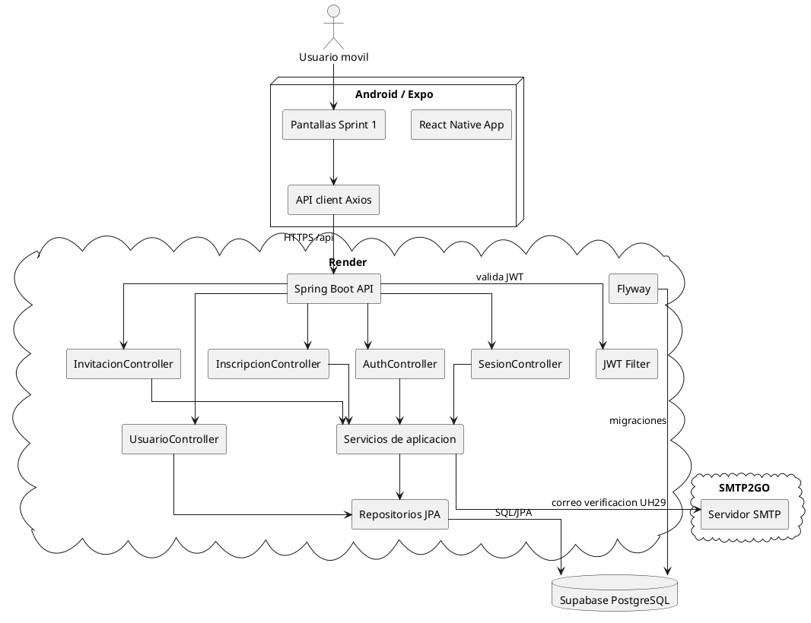

## secuencia UH01 crear evento / sesion de aprendizaje

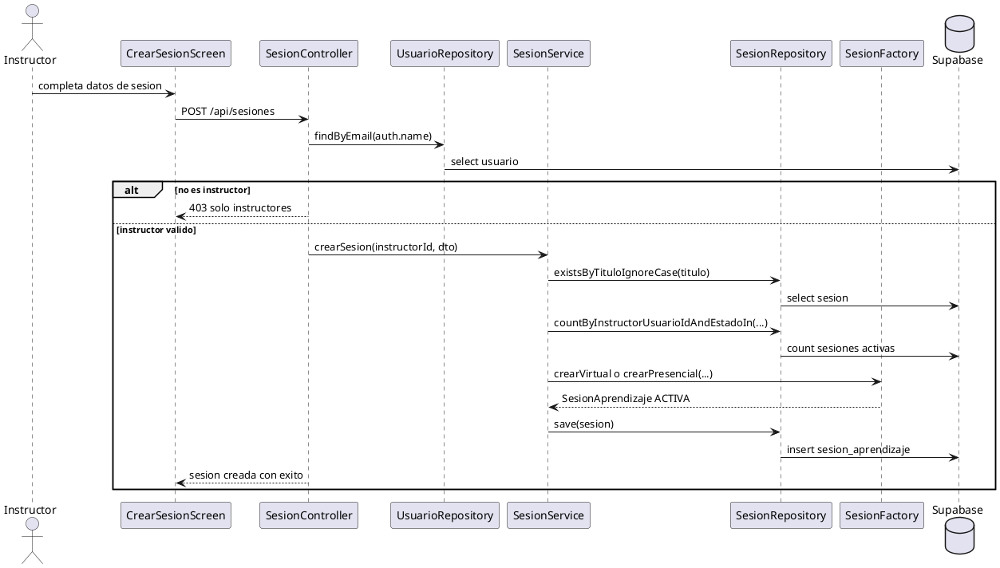

## secuencia UH02 visualizar eventos gestionados

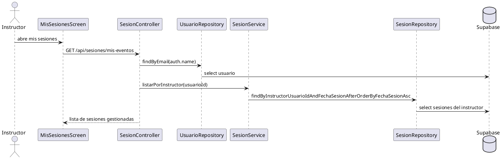

## secuencia UH04 detalle de evento

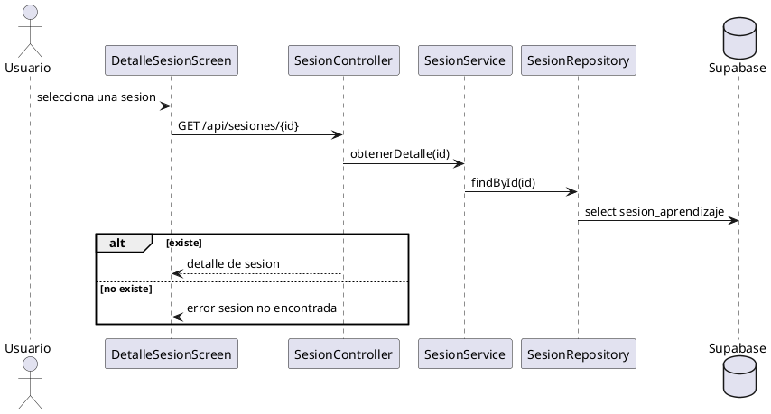

## secuencia UH06 invitar asistentes

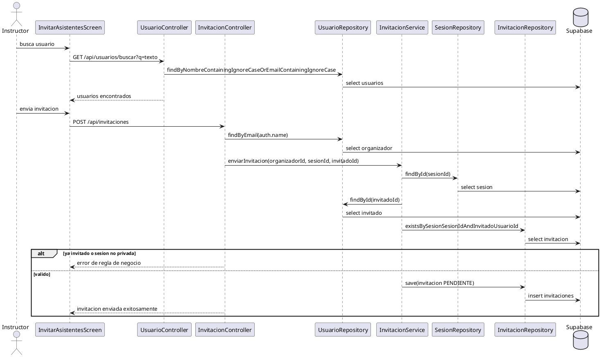

## secuencia UH07 confirmar asistencia privada

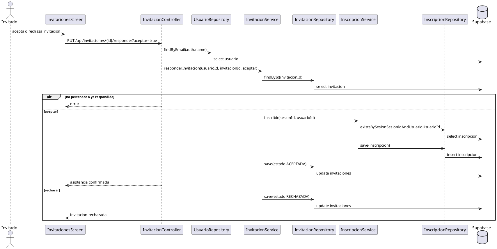

## secuencia UH10 visualizar eventos asistidos

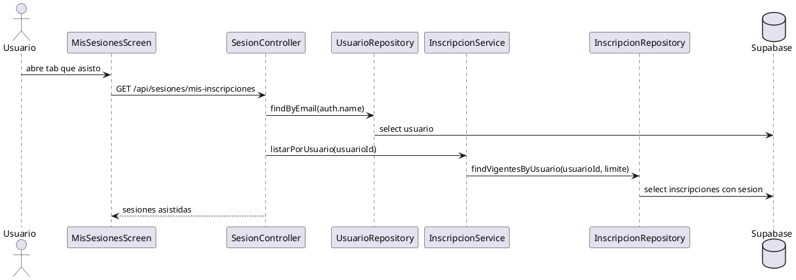

## secuencia UH14 registrarse

```plantuml
@startuml
actor Usuario
participant "RegisterScreen" as app
participant "AuthController" as ctrl
participant "UsuarioRepository" as userRepo
participant "PasswordEncoder" as encoder
participant "VerificacionTokenRepository" as tokenRepo
participant "EmailService" as email
database "Supabase" as db
cloud "SMTP2GO" as smtp

Usuario -> app : completa registro
app -> ctrl : POST /api/auth/registro
ctrl -> userRepo : existsByEmail(email)
userRepo -> db : select usuario
alt email existente
  ctrl --> app : email ya registrado
else email nuevo
  ctrl -> encoder : encode(password)
  ctrl -> userRepo : save(usuario activo=false)
  userRepo -> db : insert usuario
  ctrl -> tokenRepo : save(token)
  tokenRepo -> db : insert verificacion_token
  ctrl -> email : enviarCorreoVerificacion(destinatario, nombre, token)
  email -> smtp : enviar correo
  ctrl --> app : registro exitoso, revisar correo
end
@enduml
```

## secuencia UH15 iniciar sesion

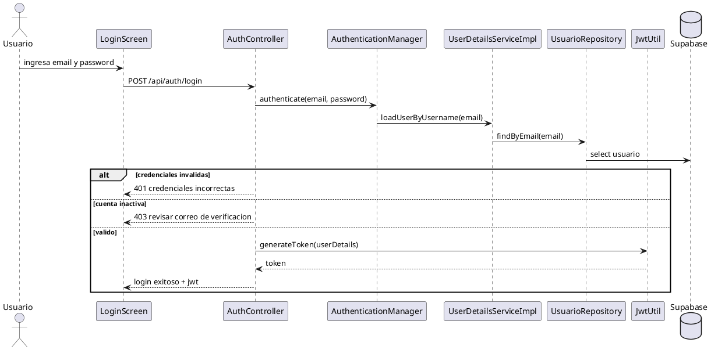

## secuencia UH16 visualizar eventos publicos

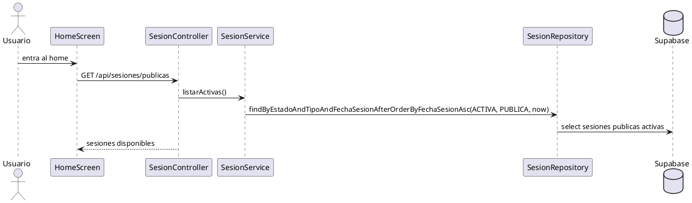

## secuencia UH17 confirmar asistencia publica

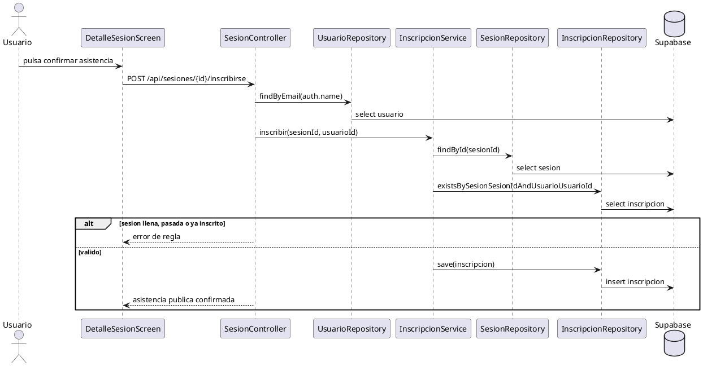

## secuencia UH23 visualizar mi perfil

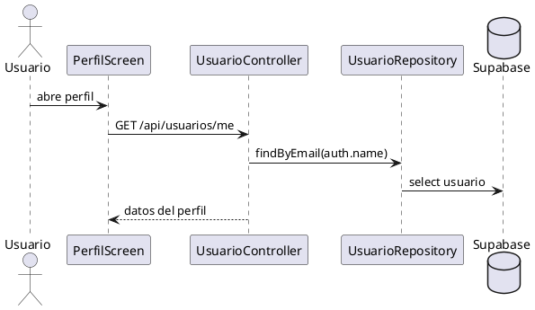

## secuencia UH24 cerrar sesion

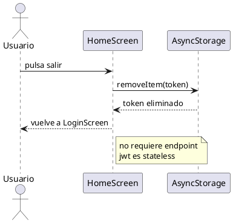

## secuencia UH26 visualizar invitados

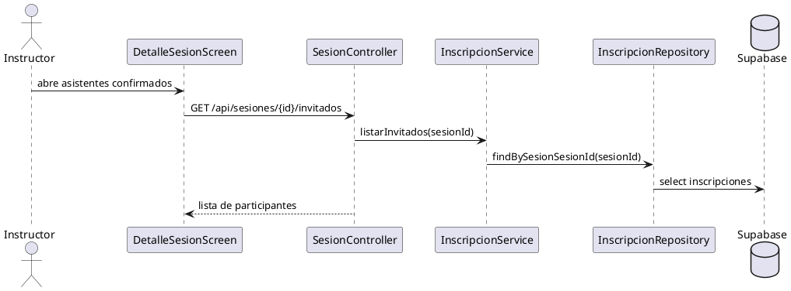

## secuencia UH28 visualizar invitaciones privadas

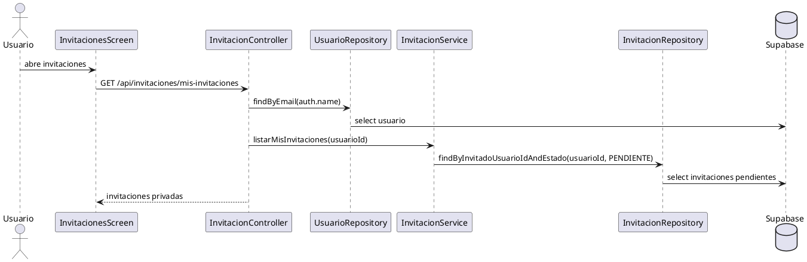

## secuencia UH29 activar cuenta

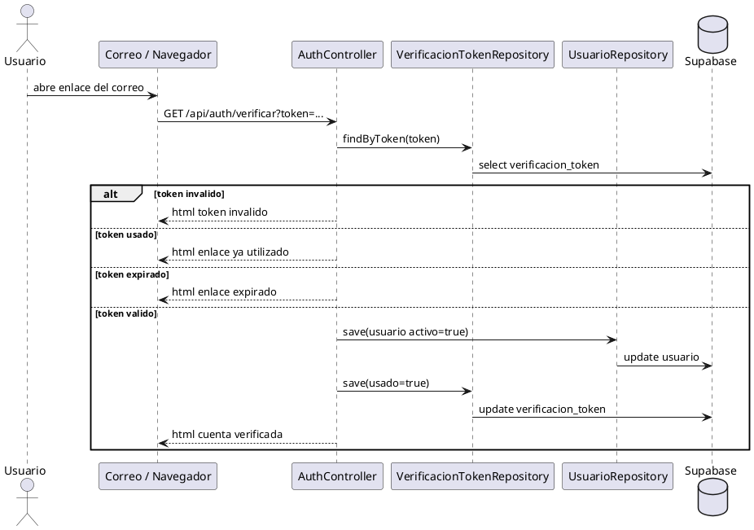
